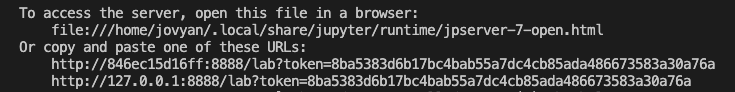

# Start Here
---

## HydroSAR

<div>


</div>

HydroSAR is a project funded by the NASA Applied Sciences Program focused on the development of algorithms for the monitoring of hydrological hazards using data from Synthetic Aperture Radar (SAR) sensors. This Jupyter Book demonstrates how to create HydroSAR products. 

This Jupyter Book currently supports:
- **HYDRO30:** Surface water extent maps per Sentinel-1 SAR image acquisition (30 m resolution)

See the [HydroSAR README](../../../README.md) for a complete list of algorithms, still under development.

---

## How To Use This Jupyter Book

### 1. Provision the software environment needed to run the notebooks

#### If Inside of OpenSARLab:
  1. Clone the [HydroSAR repository](https://github.com/HydroSAR/HydroSAR.git) to your storage volume
  2. Run the [Software_Environments notebook](./Software_Environments.ipynb) to install the required software with Conda
     - Rerun the notebook periodically to pull in environment updates.
<br><br>

#### If Outside of OpenSARLab:

**Option 1: Run a prepared HydroSAR image in a Docker container on your computer:**
1. (Prerequisite) [Docker](https://docs.docker.com/get-started/get-docker/) should be installed, and the Docker engine running 
1. Clone the [HydroSAR repository](https://github.com/HydroSAR/HydroSAR.git) to your hard drive

     `git clone https://github.com/HydroSAR/HydroSAR.git`

1. Use the following command to run the `hydrosar-jupyter` Docker image on your computer and work with JupyterLab in a browser

    `docker run --rm --init -v <path/to/hydrosar_repo>:/home/jovyan:rw -p 8888:8888 ghcr.io/hydrosar/hydrosar-jupyter:test`

   *Note: If port 8888 is already in use, you can select a different port for Jupyter by changing `8888:8888` in the above command to `8889:8888` (or another port if 8889 is also unavailable)*
   
1. Open one of the URLs provided when the jupyter server starts

   *Note: The Jupyter-provided urls may use port 8888 regardless of launching from a different port in the `docker run` command. If this happens and JupyterLab fails to load, you can manually update the port in the url to match the one you used.*
 

*Open one of the Jupyter-provided URLs to access your local server. Update the port number from 8888 if necessary.*
<br><br>

**Option 2: Run the image in a JupyterHub that accepts user provided images**
1. If you have access to a JupyterHub with [repo2docker](https://github.com/jupyterhub/repo2docker) installed, there may be an option on the server startup page allowing you to provide the location of the `hydrosar-jupyter` image in the GitHub Container Registry: `ghcr.io/hydrosar/hydrosar-jupyter:test` 
<br><br>

**Option 3: Create a conda environment on your computer:**
1. Clone the [HydroSAR repository](https://github.com/HydroSAR/HydroSAR.git) to your hard drive

     `git clone https://github.com/HydroSAR/HydroSAR.git`

1. Run the following commands to create the `hydrosar` conda environment, activate it, register its Python kernel with Jupyter, and launch JupyterLab

   ```bash
      mamba env create -f <path/to/hydrosar_repo>/notebooks/jupyter_book/jupyter_book_environment/hydrosar.yml
      mamba activate hydrosar
      python -m ipykernel install --name hydrosar
      jupyter lab
   ```
 
 ---
 

### 2. Access and Prepare RTCs for HydroSAR
1. Run the [Prepare_HydroSAR_RTC_Stack notebook](Prepare_HydroSAR_RTC_Stack.ipynb) to access RTCs from ASF (HyP3 On-Demand or OPERA)

---
### 3. Subset Data (Optional)
1. Run the [Subset_HydroSAR_Stack notebook](Subset_HydroSAR_Stack.ipynb) to subset the RTCs to common bounds

---
### 4. Create Water Maps
1. Run the [HYDRO30_Stack_Processing notebook](HYDRO30_Stack_Processing.ipynb) to generate water extent maps from a prepared stack of RTCs with HydroSAR-HYDRO30


